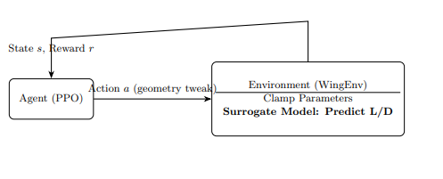

# F1 Wing Optimization using Reinforcement Learning and Surrogate Modeling

## Author Information

- **Name:** Abhinav Kalsi  
- **Affiliation:** Rochester Institute of Technology (RIT)  
- **Program:** MS in Artificial Intelligence  
- **Contact:** ak4975@rit.edu  

---

## Project Overview

This project presents a framework that utilizes reinforcement learning (RL) combined with surrogate aerodynamic modeling to optimize Formula 1 wing designs. The surrogate model—trained on synthetic CFD data generated by XFoil—accelerates evaluation of aerodynamic metrics such as lift‑to‑drag ratio (L/D). The reinforcement learning agent, implemented using Proximal Policy Optimization (PPO), iteratively improves wing geometries for optimal performance.

---

## Project Architecture



*Fig. 1: Framework integrating surrogate modeling and PPO reinforcement learning for aerodynamic optimization.*

---

## Repository Structure

```text
f1-wing-optimization/
├── README.md
├── requirements.txt
├── data/
│   ├── raw/                   # UIUC airfoil `.dat` files
│   ├── processed/             # CFD output files
│   └── surrogate_dataset.csv  # Dataset for surrogate training
├── surrogate_model/
│   ├── train_surrogate.py     # Script to train surrogate model (Python)
│   ├── predict_surrogate.py   # Script for surrogate predictions (Python)
│   └── surrogate_model.pth    # Trained surrogate weights
├── reinforcement_learning/
│   ├── ppo_optimization.py    # PPO training script
│   ├── ppo_model_eval.py      # PPO evaluation script
│   └── trained_ppo_model.zip  # Trained PPO agent
├── xfoil_integration/
│   ├── run_xfoil.cpp                   # Automated CFD runs using XFoil
│   ├── aggregate_aero_data.cpp         # Aggregate raw CFD results
│   ├── build_surrogate_dataset.cpp     # Build surrogate dataset
│   └── final_cfd_results.csv           # Aggregated CFD results
├── utils/
│   ├── convert_csv_numpy.py    # CSV → NumPy conversion
│   ├── data.py                 # Data loading & preprocessing
│   └── visualize.py            # Plotting utilities
└── figures/
    ├── architecture.png        # Framework diagram
    ├── LD_vs_AoA.png           # Lift‑to‑drag vs. AoA
    ├── CL_vs_AoA.png           # Lift coefficient vs. AoA
    └── CD_vs_AoA.png           # Drag coefficient vs. AoA
```

---

## Installation and Setup

### Environment

- **Python:** 3.9 or later  
- **PyTorch:** 2.0+  
- **Stable-Baselines3:** 2.3.2+  
- **XFoil:** Download from [XFoil Website](https://web.mit.edu/drela/Public/web/xfoil/)  
- **C++ Compiler:** Supports C++17 (e.g., GCC, MSVC)  
- **OpenMP:** For parallel processing in C++  

Install Python dependencies:

```bash
pip install -r requirements.txt
```

---

## Data Preparation

1. **Download Raw Airfoil Coordinates**  
   - Visit the UIUC Airfoil Database:  
     https://m-selig.ae.illinois.edu/ads/coord_database.html  
   - Download `.dat` files and place them in `data/raw/`.

2. **Generate Synthetic CFD Data**  
   ```bash
   g++ -std=c++17 xfoil_integration/run_xfoil.cpp \
       -o run_xfoil -fopenmp -lstdc++fs
   ./run_xfoil
   ```

3. **Aggregate Aerodynamic Results**  
   ```bash
   g++ -std=c++17 xfoil_integration/aggregate_aero_data.cpp \
       -o aggregate_aero_data -fopenmp -lstdc++fs
   ./aggregate_aero_data
   ```

4. **Build Surrogate Dataset**  
   ```bash
   g++ -std=c++17 xfoil_integration/build_surrogate_dataset.cpp \
       -o build_surrogate_dataset -lstdc++fs
   ./build_surrogate_dataset
   ```

---

## Surrogate Model Training

### Python

```bash
python surrogate_model/train_surrogate.py \
    --data data/surrogate_dataset.csv \
    --epochs 500 \
    --out surrogate_model/surrogate_model.pth
```

### C++

```bash
g++ -std=c++17 train_surrogate.cpp \
    -o train_surrogate \
    -I/path/to/libtorch/include \
    -L/path/to/libtorch/lib -ltorch -lc10 \
    -Wl,-rpath,/path/to/libtorch/lib
./train_surrogate
```

---

## PPO Agent Training

```bash
python reinforcement_learning/ppo_optimization.py \
    --surrogate surrogate_model/surrogate_model.pth \
    --output reinforcement_learning/trained_ppo_model.zip \
    --timesteps 51200
```

---

## Evaluation

```bash
python surrogate_model/predict_surrogate.py \
    --model surrogate_model/surrogate_model.pth \
    --feat 5.0 1.0 0.08 0.25 0.04 0.50

python reinforcement_learning/ppo_model_eval.py \
    --ppo reinforcement_learning/trained_ppo_model.zip \
    --surrogate surrogate_model/surrogate_model.pth
```